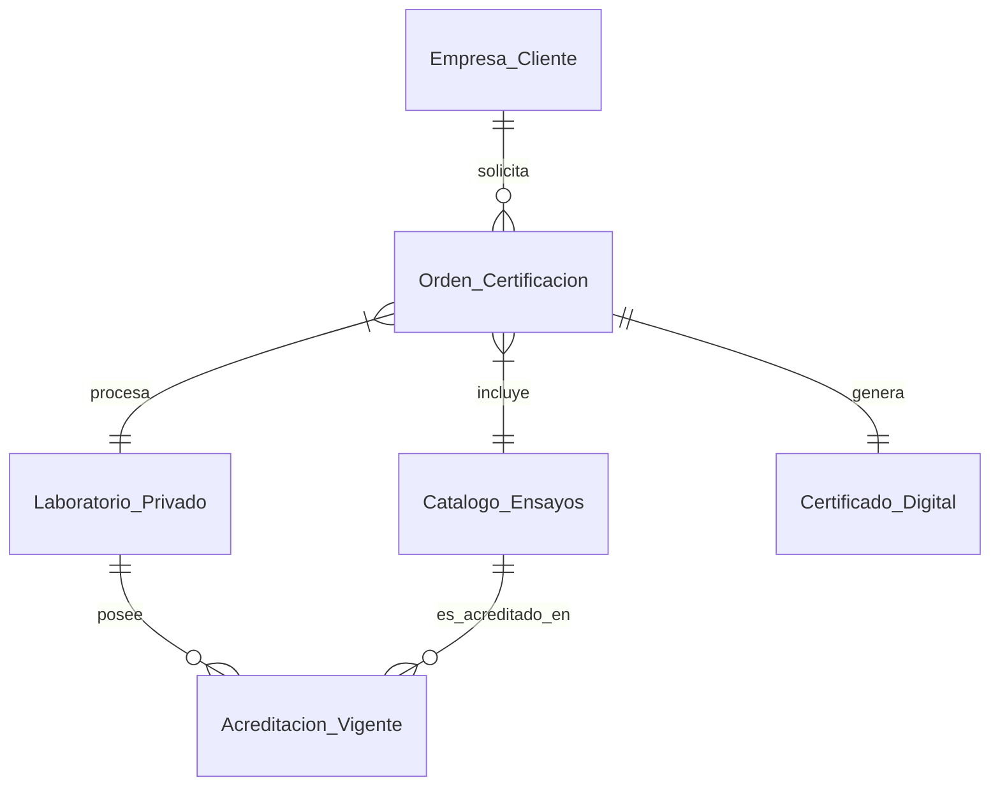

# Modelo de Datos: Lab-Match B2B

Este documento define la estructura lógica para el Marketplace de Certificación Técnica que reemplaza la función de default del INTI.

## Entidades Principales

### 1. Entidad: `Empresa_Cliente`
Representa a la demanda (PyMEs exportadoras, industrias).
- `id`: UUID
- `razon_social`: String
- `cuit`: String (index)
- `sector`: Enum (Alimentos, Minería, Textil, Ambiente)
- `necesidad_compliance`: Array [[EUDR]], [[CBAM]], [[FSMA]], [[China]]

### 2. Entidad: `Laboratorio_Privado`
Representa a la oferta de capacidad técnica.
- `id`: UUID
- `nombre_comercial`: String
- `razon_social`: String
- `acreditacion_oaa_id`: String (Clave para validación de confianza)
- `director_tecnico`: String
- `geolocalizacion`: Point (Para optimización logística de muestras)
- `rating_velocidad`: Float (Basado en cumplimiento de SLAs históricos)

### 3. Entidad: `Catalogo_Ensayos`
El diccionario de servicios técnicos (mapeado del Anexo I Res. 42/2026 INTI).
- `id`: UUID
- `codigo_ensayo`: String (ej. "MIC-SAL-01")
- `descripcion`: String (ej. "Detección de Salmonella spp")
- `matriz`: String (ej. "Carne bovina", "Agua industrial")
- `metodo_referencia`: String (ej. "ISO 6579-1")
- `categoria`: Enum (Microbiología, Fisicoquímica, Metrología, Ensayos Físicos)

### 4. Relación: `Acreditacion_Vigente`
Vincula laboratorios con los ensayos que están habilitados para firmar.
- `id`: UUID
- `laboratorio_id`: FK -> Laboratorio_Privado
- `ensayo_id`: FK -> Catalogo_Ensayos
- `fecha_vencimiento_oaa`: Date
- `alcance_acreditacion`: String (Detalle técnico de la habilitación)

### 5. Entidad: `Orden_Certificacion`
El objeto transaccional (El "Viaje" de Uber).
- `id`: UUID
- `cliente_id`: FK -> Empresa_Cliente
- `laboratorio_id`: FK -> Laboratorio_Privado
- `ensayo_id`: FK -> Catalogo_Ensayos
- `estado`: Enum (Pendiente, Retiro_Muestra, En_Analisis, Reportado, Cancelado)
- `logistica_id`: String (Tracking de Andreani/OCASA)
- `fecha_muestreo`: DateTime
- `sla_acordado`: Integer (Días hábiles)

### 6. Entidad: `Certificado_Digital`
El activo final de valor B2B.
- `id`: UUID
- `orden_id`: FK -> Orden_Certificacion
- `hash_pdf`: String (SHA-256 para integridad)
- `blockchain_tx_id`: String (Opcional: para inmutabilidad internacional)
- `qr_verificacion`: String (URL pública de validación rápida)
- `fecha_emision`: DateTime

---

## Diagrama de Relaciones (Mermaid)

## Próximos Pasos Técnicos
1. **Poblamiento:** Ingerir el Anexo I de la Res. 42/2026 para completar el `Catalogo_Ensayos`.
2. **Matching Engine:** Desarrollar la lógica que filtre `Laboratorio_Privado` basándose en `Acreditacion_Vigente` y cercanía logística al `Cliente`.
3. **Módulo de Alertas:** Notificar al `Cliente` cuando un `Certificado_Digital` está por vencer según los ciclos de auditoría de sus compradores externos.
