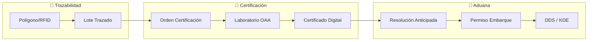

# Trade Compliance Platform (Plataforma Unificada de Exportación)

**Estado:** EN EVALUACIÓN (Alta convicción estratégica; ejecución prematura)
**Hipótesis de convergencia:** [[Trazabilidad_Agro_Exportadora]] + [[Certificacion_Inocuidad_Privada]] + [[Aduana_as_a_Service]]
**Última Revisión:** 2026-04-22

## Tesis
El exportador argentino enfrenta 3 frentes de compliance simultáneos ante la retirada del Estado:
1. **Trazabilidad** (EUDR/RFID): demostrar origen limpio.
2. **Certificación** (OAA/INTI/FDA): demostrar que el producto es seguro.
3. **Aduana** (RAF/DNU 41): demostrar que el despacho es legal.

Cada frente comparte el mismo cliente, los mismos datos y el mismo flujo regulatorio. Una plataforma que integre los 3 eslabones elimina la fricción entre sistemas desconectados y captura al exportador con un lock-in por integración.

## Flujo de Datos

## Estrategia de Construcción (Secuencial)
1. **Fase 1 (0-6m):** Lab-Match — Workflow de certificación para laboratorios privados.
2. **Fase 2 (6-12m):** Integración aduanera — El certificado alimenta el despacho.
3. **Fase 3 (12-18m):** Trazabilidad upstream — RFID ganadero + auditoría satelital.

## Análisis Escéptico
→ Ver análisis completo en el artefacto de conversación.

**Veredicto:** Estratégicamente correcto. Operativamente prematuro. La plataforma no se diseña; emerge. Empezar con Lab-Match standalone.

## Vínculos
- [[Trazabilidad_Agro_Exportadora]]
- [[Certificacion_Inocuidad_Privada]]
- [[Aduana_as_a_Service]]
- [[Modelo_Datos_LabMatch]]
- [[Resoluciones_Anticipadas]]
